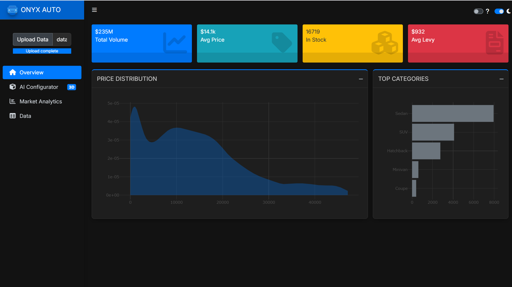
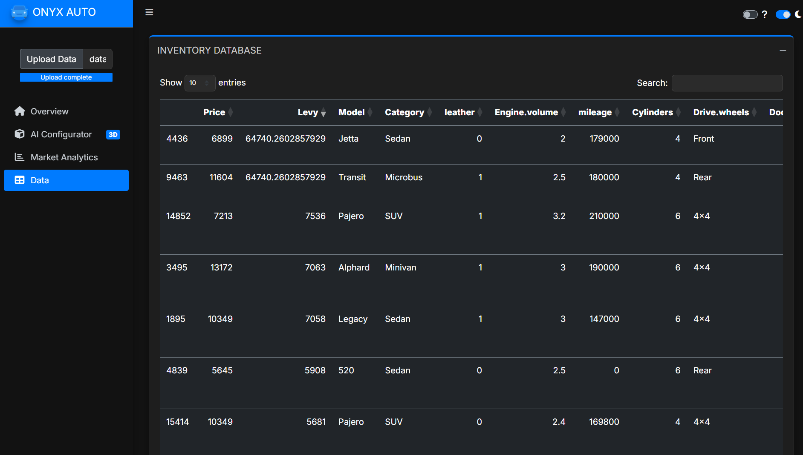
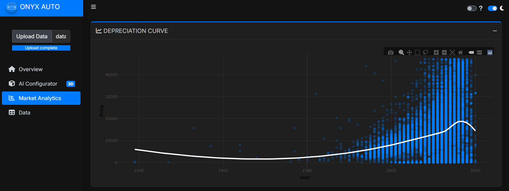

# 💎 Onyx Auto Analytics
### *Precision Pricing & Market Intelligence Engine*


---

## 📖 Executive Summary
**Onyx Auto Analytics** is an end-to-end data science ecosystem designed to analyze, visualize, and predict vehicle market values. Built on a dataset of **19,000+ automotive records**, this project bridges the gap between raw data and actionable intelligence.

The platform consists of three core pillars:
1.  **Statistical Inference:** Rigorous hypothesis testing to understand price determinants.
2.  **Machine Learning:** A Random Forest regressor for high-accuracy price estimation.
3.  **The Onyx Dashboard:** A production-grade `bs4Dash` application featuring a real-time AI Configurator and 3D visualization elements.

---

## 🖥️ The Interface (Onyx Dashboard)

### 1. 📊 Mission Control
The home dashboard provides an immediate pulse on the market, tracking KPIs like Total Volume, Average Levy, and Stock Levels. It visualizes the right-skewed nature of the market, identifying the dominance of budget-friendly vehicles versus luxury outliers.



### 2. 🔮 The Forecasting Studio (AI Configurator)
The crown jewel of the application. This module allows users to interact directly with the **Random Forest** model.
* **Real-Time Inference:** Users configure a vehicle (Brand, Year, Mileage, Gearbox), and the model calculates the estimated market value instantly.
* **Dynamic Visuals:** The 3D car render adapts its color via CSS filters based on user selection.
* **Market Context:** A gauge chart visualizes where the predicted price sits within the broader price spectrum.


### 3. 🗂️ Inventory Explorer
Transparency is key. The Data Explorer module utilizes the `DT` library to provide a searchable, sortable view of the raw training data. It allows stakeholders to verify model inputs and explore specific car configurations manually.



---
## 📂 The Dataset

The project utilizes a rich dataset comprising **19,237 records** of car sales transactions. It includes a mix of numerical, categorical, and text-based features used to determine vehicle valuation.

### 📋 Feature Dictionary

| Variable | Type | Description |
| :--- | :--- | :--- |
| **Price** | `Numeric` | The target variable. Transaction price of the vehicle (USD). |
| **Levy** | `Numeric` | Tax amount associated with the vehicle. |
| **Manufacturer** | `Categorical` | Brand of the car (e.g., Toyota, BMW, Mercedes-Benz). |
| **Model** | `Categorical` | Specific model name (e.g., Prius, E-Class). |
| **Prod. Year** | `Numeric` | The year the vehicle was manufactured. |
| **Category** | `Categorical` | Body style (e.g., Sedan, SUV, Hatchback). |
| **Leather Interior** | `Binary` | Presence of leather seats (Yes/No). |
| **Fuel Type** | `Categorical` | Energy source (Petrol, Diesel, Hybrid, CNG). |
| **Engine Volume** | `Numeric` | Engine size in liters. Includes "Turbo" designation. |
| **Mileage** | `Numeric` | Total distance driven (km). |
| **Cylinders** | `Numeric` | Number of cylinders in the engine. |
| **Gear Box Type** | `Categorical` | Transmission style (Automatic, Manual, Tiptronic). |
| **Drive Wheels** | `Categorical` | Drivetrain configuration (FWD, RWD, 4x4). |
| **Airbags** | `Numeric` | Number of airbags installed for safety. |

---
## 🧠 The Science

### 🔍 1. Exploratory Data Analysis (EDA)
We conducted a deep dive into the dataset, revealing critical market trends regarding price distribution and skewness. We applied **Winsorization** to handle extreme outliers in Price and Mileage before modeling.



### 📈 2. Market Dominance & Brand Positioning
Our analysis highlighted clear market leaders. Toyota dominates the inventory volume, while brands like Mercedes-Benz and Lexus command higher average price points, creating distinct market segments.


### 🧪 3. Statistical Inference
We moved beyond visualization to statistical proof using R's inference capabilities:
* **T-Tests:** Confirmed a statistically significant price difference between Left-Wheel and Right-Hand drive cars.
* **ANOVA:** Analyzed price variance across transmission types (Automatic vs. Manual vs. Tiptronic).
* **Chi-Square:** Validated the dependency between Gearbox types and Vehicle Categories.

### 🤖 4. Machine Learning Pipeline
* **Algorithm:** Random Forest Regressor (`randomForest` package).
* **Preprocessing:** Log-transformations for skewed features and label encoding for categorical variables.
* **Features:** Year, Mileage, Brand, Fuel, Category, Gearbox, Leather Interior, Turbo status.

---

## 🧬 Simulation Study: "The Digital Twin"
To test the robustness of our data cleaning pipelines, we engineered a synthetic dataset that mirrors the statistical properties of the real world.

* **Generation:** Created 19,237 records using Log-Normal distributions for Price and Exponential distributions for Mileage.
* **Controlled Chaos:** We intentionally injected specific error modes to test cleaning logic:
    * **5%** Missing Numeric Data (MCAR).
    * **2%** Typos in Categorical variables ( "Toyota_typo").
    * **2%** Extreme Numeric Outliers.
* **Outcome:** The cleaning pipeline successfully recovered the original distribution properties from the corrupted synthetic data.

---

## 📂 Repository Structure

The project is organized into a modular structure to separate the **production application** from the **exploratory analysis**.

```text
onyx-auto-analytics/
│
├── 📂 app/                     # 🚀 The Production Dashboard
│   └── app.R                   #    Main Shiny application source code (UI & Server)
│
├── 📂 analysis/                # 🧠 Data Science & Research
│   ├── 01_eda_and_model.qmd    #    Full EDA, Hypothesis Testing & Random Forest Training
│   └── 02_simulation.qmd       #    Synthetic Data Study & Cleaning Pipeline Validation
│
├── 📂 scripts/                 # 🛠️ Utilities & Helpers
│   └── generate_simulation.R   #    Raw R script for generating the synthetic dataset
│
├── 📂 assets/                  # 📸 Project Documentation
│   ├── dashboard-preview.png   #    Home screen screenshot
│   ├── forecasting-studio.png  #    AI Configurator screenshot
│   ├── data-explorer.png       #    Data Table screenshot
│   ├── price-dist.png          #    EDA Plot screenshot
│   └── market-share.png        #    Market Analytics screenshot
│
└── 📜 README.md                # 📖 Project Documentation & Setup Guide
```
## 🛠️ Tech Stack

| Component | Technology | Description |
| :--- | :--- | :--- |
| **Core** | R 4.3+ | Primary language for analysis, statistical inference, and application logic. |
| **UI Framework** | `shiny`, `bs4Dash` | Professional Bootstrap 4 dashboard framework with custom CSS styling. |
| **Data Wrangling** | `tidyverse`, `janitor` | Comprehensive ETL pipelines, data cleaning, and manipulation. |
| **Visualization** | `ggplot2`, `plotly` | High-quality static plots and interactive, web-ready charts. |
| **Modeling** | `randomForest` | Predictive modeling engine used for the price estimation algorithm. |
| **Tables** | `DT` | Interactive data tables with search, sort, and pagination capabilities. |
## 🚀 Getting Started

Follow these steps to set up the project locally on your machine.

### 1. Prerequisites
Ensure you have the following installed:
* [R](https://cran.r-project.org/) (Version 4.0 or higher)
* [RStudio](https://posit.co/download/rstudio-desktop/) (Recommended)
* [Git](https://git-scm.com/)

### 2. Clone the Repository
Open your terminal or Git Bash and run:

```bash
git clone [https://github.com/Wttcss/onyx-auto-analytics.git](https://github.com/Wttcss/onyx-auto-analytics.git)
cd onyx-auto-analytics
``` 
### 3. Install Dependencies
Open the project in RStudio (`onyx-auto-analytics.Rproj`) and run the following command in the R Console to install the required libraries:

```r
install.packages(c(
  "shiny", 
  "bs4Dash", 
  "tidyverse", 
  "plotly", 
  "randomForest", 
  "DT", 
  "janitor",
  "shinycssloaders",
  "shinyWidgets"
))
```
### 4. Run the Application
You can launch the dashboard directly from the R console:
shiny::runApp("app/app.R")
Alternatively, open app/app.R in RStudio and click the Run App button in the top right corner of the script editor.
